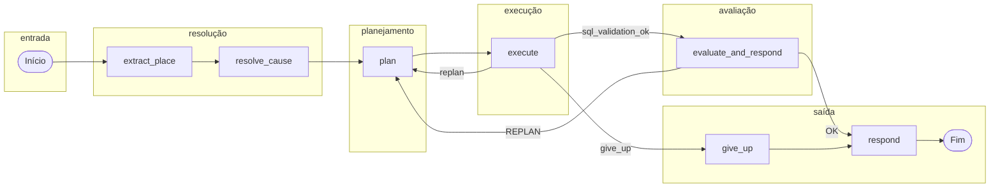

# Sistema de Dados Saúde (Datasus)

Aplicação em Streamlit para download, processamento e análise de dados do **SIM** (Sistema de Informações sobre Mortalidade) do Datasus.

## O que o sistema faz

- **Download de dados**: obtém arquivos SIM (óbitos) do FTP do Datasus por UF e ano, em formato Parquet.
- **Processamento**: pipeline em camadas (raw → silver → gold) com DuckDB; view analítica com faixa etária, legendas (sexo, raça/cor, CID-10, etc.) e join com municípios.
- **Análise exploratória**: filtros por período, sexo, faixa etária, UF, município e causa; série temporal, óbitos por causa, por território (estados/municípios), pirâmide etária.
- **Perguntas em linguagem natural (Text-to-SQL)**: agente de IA que interpreta perguntas sobre óbitos, gera SQL e devolve a resposta; suporta Gemini, Groq e Ollama.
- **Editor SQL**: consultas diretas à view de óbitos.
- **Dashboard**: visão de mortalidade (forecast).
- **Configurações**: período e UFs padrão para download, persistidos em SQLite (`data/config.db`).

## Requisitos

- Python 3.10+
- Dependências listadas em `requirements.txt`

## Instalação

```bash
# Clone o repositório (ou use o diretório do projeto)
cd DatasusBrasileiroApp

# Crie e ative um ambiente virtual
python3 -m venv .venv
source .venv/bin/activate   # Linux/macOS
# ou: .venv\Scripts\activate   # Windows

# Instale as dependências
pip install -r requirements.txt
```

## Como executar

```bash
streamlit run app.py
```

O navegador abrirá em `http://localhost:8501`. Use a barra lateral para acessar:

- **Configurações** – anos e UFs padrão para download; chaves de API (Gemini/Groq) e modelo para o agente Text-to-SQL.
- **SIM**
  - **Download de Dados** – baixar arquivos do FTP, processar (raw → silver) e construir a camada gold.
  - **Análise Exploratória** – gráficos e filtros sobre óbitos (requer gold construída).
  - **Consulta em linguagem natural** – perguntas em texto (ex.: “Quantos óbitos por dengue em 2023?”); o agente gera a SQL e mostra a resposta.
  - **Editor SQL** – consultas diretas à view de óbitos.
  - **Dashboard Mortalidade** – indicadores de mortalidade.

## Estrutura de dados

As pastas são criadas automaticamente quando necessário:

| Camada   | Caminho           | Conteúdo |
|----------|-------------------|----------|
| Raw      | `data/SIM/raw/`   | Parquets baixados do FTP (por UF/ano). |
| Silver   | `data/SIM/silver/`| Parquets tratados (óbitos, legendas, municípios). |
| Gold     | `data/SIM/gold/`  | DuckDB com view `v_obitos_completo` (idade, idade_anos, faixa_etaria, causas, etc.). |

- **Config**: `data/config.db` (SQLite) – preferências de anos e UFs; criado ao usar Configurações.

Nenhuma dessas pastas nem os arquivos de dados (`.parquet`, `.duckdb`, `config.db`) precisam ser versionados; o `.gitignore` já os exclui.

## Agente Text-to-SQL

O módulo de **consulta em linguagem natural** usa um agente que transforma perguntas em português em consultas SQL sobre a view `v_obitos_completo`, executa e devolve a resposta em texto.

- **Provedores**: Google (Gemini), Groq (Llama) ou Ollama (local). Configure em **Configurações**.
- **Guardrail**: perguntas fora do tema (óbitos, mortalidade, SIM) são rejeitadas sem chamar o modelo.
- **Contexto**: o agente resolve lugar (município/UF) e causa (doença/capítulo CID-10) a partir da pergunta e injeta valores canônicos na SQL (evita ILIKE e códigos inventados).
- **Schema e cache**: colunas e exemplos de valores vêm da própria view; um único aquecimento de cache (uma conexão DuckDB) alimenta schema, exemplos e lista de municípios, reduzindo consultas repetidas.

### Grafo do modelo (LangGraph)

Fluxo do agente: extração de lugar → resolução de causa → planejamento (geração de SQL) → execução (EXPLAIN + query na mesma conexão) → avaliação e resposta; em caso de erro de SQL ou resposta inadequada, o fluxo pode voltar ao planejamento (replan) até um limite de tentativas.



**Nós:**

| Nó | Descrição |
|----|-----------|
| `extract_place` | Extrai menção a lugar (cidade/estado) da pergunta e resolve para município/UF canônicos (valores da view). |
| `resolve_cause` | Identifica menção a causa/doença e obtém códigos CID-10 ou capítulo (ex.: “doenças cardiovasculares” → `causa_cid10_capitulo_desc IN ('Capítulo IX - ...')`). |
| `plan` | LLM gera uma única query SQL (SELECT) a partir do schema da view, contexto de lugar e de causa. |
| `execute` | Valida a SQL com EXPLAIN e executa na mesma conexão DuckDB; em falha, retorna feedback para replan. |
| `evaluate_and_respond` | LLM avalia se o resultado responde à pergunta e formata a resposta ou pede REPLAN. |
| `give_up` | Após limite de tentativas ou erro fatal, encerra com mensagem ao usuário. |
| `respond` | Retorna a resposta final e encerra o grafo. |

## Fluxo recomendado

1. Abra **Configurações** e defina anos e UFs desejados; se for usar o agente Text-to-SQL, configure provedor e chave de API.
2. Em **SIM → Download de Dados**, baixe os arquivos e rode o processamento (silver e gold).
3. Use **Análise Exploratória** para filtrar e visualizar óbitos (série temporal, causas, território, pirâmide etária) ou **Consulta em linguagem natural** para perguntas em texto.

## Licença

Uso dos dados conforme termos do [Datasus](https://datasus.saude.gov.br/). Código deste repositório sob licença de sua escolha.
