# MortalityForecaster — Pipeline de Previsão de Mortalidade

> Material de apresentação — Disciplina de Séries Temporais

---

## Visão Geral

O `MortalityForecaster` é um pipeline automatizado de previsão de séries temporais de mortalidade. Ele adota uma abordagem **premise-first**: antes de ajustar qualquer modelo, testes estatísticos formais são aplicados para caracterizar a estrutura da série. Os resultados desses testes guiam a seleção de modelos candidatos e o critério de escolha final.

O pipeline aceita séries **anuais** ou **mensais** e produz:
- Previsão pontual para `h` períodos à frente
- Intervalos de predição de 80 % e 95 %
- Métricas de erro (MAPE e RMSE)
- Diagnósticos completos da série

---

## Fluxograma do Pipeline

```mermaid
flowchart TD
    %% ── Entrada ───────────────────────────────────────────────────
    START(["`**ENTRADA**
    série · frequência · horizonte h`"])
    START --> CHK_N{n &lt; 5 ?}
    CHK_N -- Sim --> TRIVIAL(["`Média Simples
    *(fallback)*`"])
    CHK_N -- Não --> F2_MK

    %% ── Fase 2 — Auditoria Estrutural ────────────────────────────
    subgraph F2 ["  FASE 2 — Auditoria Estrutural  "]
        direction TB
        F2_MK["`**Mann-Kendall**
        tendência monotônica?`"]
        F2_CS["`**Cox-Stuart**
        tendência por pares?`"]
        F2_MK --> F2_CS
        F2_CS --> F2_TREND{"`Ambos
        p &lt; 0,05 ?`"}
        F2_TREND -- Sim --> T_YES(["trend = **True**"])
        F2_TREND -- Não --> T_NO(["trend = **False**"])

        T_YES & T_NO --> F2_ADF

        F2_ADF["`**ADF**
        Raiz Unitária
        → n_diffs ∈ {0,1,2}`"]

        F2_ADF --> F2_CHK_S{"`Mensal
        e n ≥ 24 ?`"}
        F2_CHK_S -- Não --> S_NO(["seasonal = **False**"])
        F2_CHK_S -- Sim --> F2_SEAS
        F2_SEAS["`**Teste F**
        dummies mensais via OLS`"]
        F2_SEAS --> F2_SEAS_P{p &lt; 0,05 ?}
        F2_SEAS_P -- Sim --> S_YES(["seasonal = **True**"])
        F2_SEAS_P -- Não --> S_NO

        S_YES & S_NO --> F2_OUT
        F2_OUT["`**Outliers**
        IQR extremo ∩ resíduo > 3σ
        → dummies exógenas`"]
    end

    %% ── Fase 3 — Corrida de Modelos ──────────────────────────────
    F2_OUT --> F3_START

    subgraph F3 ["  FASE 3 — Corrida de Modelos  "]
        direction TB
        F3_START["`**Auto-ARIMA** *(stepwise)*
        usa trend · seasonal · n_diffs · exog
        filtro: Ljung-Box p > 0,05`"]

        F3_ETS["`**ETS** *(Holt-Winters)*
        damped se anual
        filtro: Ljung-Box p > 0,05`"]

        F3_CHK_XGB{"`Mensal
        e n ≥ 60 ?`"}

        F3_XGB["`**XGBoost**
        features de lag · hist · early stop`"]

        F3_RM["`**Rolling Mean**
        *(linha de base — sempre presente)*`"]

        F3_START --> F3_ETS --> F3_CHK_XGB
        F3_CHK_XGB -- Sim --> F3_XGB --> F3_RM
        F3_CHK_XGB -- Não --> F3_RM
    end

    %% ── Fase 5 — Seleção ─────────────────────────────────────────
    F3_RM --> F5_CHK

    subgraph F5 ["  FASE 5 — Seleção do Modelo  "]
        direction TB
        F5_CHK{"`Mensal
        e n ≥ 60 ?`"}

        F5_HOLDOUT["`**Hold-out**
        re-treina em x\[:-h\]
        avalia RMSE em x\[-h:\]`"]

        F5_AICC["`**AICc mínimo**
        entre ARIMA e ETS
        *(fallback: Rolling Mean)*`"]

        F5_MARGINAL{"`RMSE_melhor
        ≥ 0,95 × RMSE_RM ?`"}

        F5_RM2(["Seleciona **Rolling Mean**
        *(estabilidade)*"])
        F5_BEST(["Seleciona **melhor modelo**"])

        F5_CHK -- Sim --> F5_HOLDOUT --> F5_MARGINAL
        F5_CHK -- Não --> F5_AICC --> F5_BEST
        F5_MARGINAL -- Sim --> F5_RM2
        F5_MARGINAL -- Não --> F5_BEST
    end

    %% ── Saída ─────────────────────────────────────────────────────
    F5_BEST & F5_RM2 --> OUT_PI
    OUT_PI["`**Intervalos de Predição**
    IC₈₀: ± 1,282 · σ · √h
    IC₉₅: ± 1,960 · σ · √h`"]

    OUT_PI --> OUT_ERR
    OUT_ERR["`**MAPE & RMSE**
    hold-out se disponível
    in-sample caso contrário`"]

    OUT_ERR --> RESULT(["`**ForecastResult**
    ponto · IC80 · IC95
    MAPE · RMSE · diagnósticos`"])
    TRIVIAL --> RESULT

    %% ── Estilos ───────────────────────────────────────────────────
    classDef phase    fill:#1f2937,stroke:#374151,color:#f9fafb
    classDef decision fill:#1e3a5f,stroke:#2563eb,color:#bfdbfe
    classDef model    fill:#14532d,stroke:#16a34a,color:#bbf7d0
    classDef io       fill:#3b0764,stroke:#7c3aed,color:#e9d5ff
    classDef flag     fill:#422006,stroke:#d97706,color:#fde68a

    class START,RESULT,TRIVIAL io
    class CHK_N,F2_TREND,F2_CHK_S,F2_SEAS_P,F3_CHK_XGB,F5_CHK,F5_MARGINAL decision
    class F2_MK,F2_CS,F2_ADF,F2_SEAS,F2_OUT phase
    class F3_START,F3_ETS,F3_XGB,F3_RM model
    class F5_HOLDOUT,F5_AICC,OUT_PI,OUT_ERR flag
    class T_YES,T_NO,S_YES,S_NO,F5_BEST,F5_RM2 phase
```



---

## Fase 2 — Auditoria Estrutural

### Tendência

Dois testes independentes são exigidos para confirmar tendência. Apenas se **ambos** rejeitarem H₀ (p < 0,05) a tendência é considerada confirmada.

| Teste | H₀ | Implementação |
|---|---|---|
| **Mann-Kendall** | Sem tendência monotônica | O(n log n) vetorizado — soma de sinais de diferenças par-a-par |
| **Cox-Stuart** | Sem tendência | Teste binomial sobre pares (xᵢ, xᵢ₊ₙ/₂) |

### Estacionariedade

O **Teste ADF** (Augmented Dickey-Fuller) com seleção automática de defasagens (AIC) determina o número de diferenças necessárias para tornar a série estacionária (0, 1 ou 2).

| Resultado do ADF | Interpretação | `n_diffs` |
|---|---|---|
| p < 0,05 — **significativo** | Rejeita H₀ de raiz unitária → série **estacionária** | 0 |
| p ≥ 0,05 — **não significativo** | Não rejeita H₀ → série **não estacionária** | testa Δx |
| ↳ ADF em Δx: p < 0,05 | Primeira diferença é estacionária | 1 |
| ↳ ADF em Δx: p ≥ 0,05 | Primeira diferença ainda não estacionária | 2 |

O valor de `n_diffs` é usado exclusivamente no **Auto-ARIMA** como o parâmetro `d` fixo (`auto_arima(..., d=n_diffs)`), ancorando a busca no espaço correto de modelos ARIMA(p, **d**, q) e evitando diferenciações contraditórias com o teste.

> **ETS e XGBoost ignoram `n_diffs`** — o ETS lida com não-estacionariedade via componente de tendência; o XGBoost remove a tendência por regressão linear antes do ajuste.

### Sazonalidade (somente mensal, n ≥ 24)

Regressão OLS com **dummies mensais** (11 variáveis indicadoras). O teste F avalia se os efeitos sazonais explicam variância significativa (p < 0,05).

### Outliers

Combinação de dois critérios — um ponto é marcado como outlier **somente se atender aos dois**:

1. **IQR extremo**: x < Q1 − 3·IQR  ou  x > Q3 + 3·IQR
2. **Resíduo da tendência linear**: |resíduo| > 3·σ (após remoção de tendência por `np.polyfit`)

Outliers detectados são incorporados como variáveis exógenas (dummies) no Auto-ARIMA.

---

## Fase 3 — Modelos Candidatos

### Auto-ARIMA
- Busca stepwise no espaço (p, d, q)(P, D, Q)₁₂
- Critério de informação: **AICc** (corrigido para amostras pequenas)
- Filtro de qualidade: **Ljung-Box** (p > 0,05) — resíduos sem autocorrelação residual
- Aceita variáveis exógenas (dummies de outliers)

### ETS (Holt-Winters)
- Componente de tendência: aditiva se `trend = True`, ausente caso contrário
- Amortecimento da tendência (`damped_trend`): ativado para séries **anuais** — reduz extrapolação excessiva
- Componente sazonal: aditivo se `seasonal = True`
- Filtro de qualidade: **Ljung-Box** (p > 0,05)

### XGBoost *(apenas mensal, n ≥ 60)*
- Série destrended (remoção de tendência linear antes do ajuste)
- Features: `max_lags = min(12, n//4)` valores defasados
- Regularização: `max_depth=3`, subsampling (0,8)
- Eficiência: `tree_method='hist'` + early stopping em 20 % de hold-out interno
- Previsão iterativa: cada passo h usa as previsões anteriores como features

### Rolling Mean *(linha de base)*
- Sempre presente como alternativa de fallback
- Janela: 12 períodos (mensal) ou 3 períodos (anual)
- AICc = ∞ — elegível apenas por RMSE de validação ou como fallback

---

## Fase 5 — Seleção do Modelo

### Caminho 1: Séries mensais com n ≥ 60 — Validação Hold-out

```
x_treino = x[:-h]     x_teste = x[-h:]
```

Cada modelo é **re-treinado** em `x_treino` e suas previsões são avaliadas em `x_teste` via RMSE. O modelo com menor RMSE vence, **exceto** se sua vantagem for marginal:

> Se `RMSE_melhor ≥ 0,95 × RMSE_RollingMean` → seleciona Rolling Mean (estabilidade)

### Caminho 2: Demais séries — AICc

Seleciona o modelo paramétrico com menor AICc entre Auto-ARIMA e ETS. O Rolling Mean é acionado somente se nenhum modelo paramétrico sobreviver à auditoria de resíduos (Ljung-Box).

---

## Intervalos de Predição

Baseados nos resíduos do modelo selecionado, com expansão proporcional ao horizonte:

```
σ = desvio padrão dos resíduos
IC₈₀: ponto ± 1,282 · σ · √h
IC₉₅: ponto ± 1,960 · σ · √h
```

A escala `√h` reflete a incerteza crescente à medida que o horizonte se afasta — equivalente ao comportamento de um passeio aleatório.

---

## Métricas de Erro

| Situação | Estratégia |
|---|---|
| Mensal, n ≥ 60 | MAPE e RMSE sobre o hold-out real (out-of-sample) |
| Demais casos | MAPE e RMSE sobre resíduos in-sample do modelo ajustado |

> MAPE é definido como `None` quando qualquer valor observado é zero (evita divisão por zero).

---

## Diagrama de Decisão Resumido

```
série de mortalidade
       │
       ▼
  n < 5? ──Sim──► Média Simples
       │
       ▼
 [Auditoria Estrutural]
  • Mann-Kendall + Cox-Stuart → tendência?
  • ADF → nº de diferenças
  • Teste F sazonal → sazonalidade?
  • IQR + resíduo → outliers?
       │
       ▼
 [Corrida de Modelos]
  Auto-ARIMA · ETS · XGBoost* · Rolling Mean
       │
       ▼
  n ≥ 60 mensal?
    ├─Sim─► Re-treino em x[:-h] → RMSE em x[-h:]
    │         └─ marginal vs RM? → Rolling Mean
    └─Não─► AICc mínimo entre ARIMA e ETS
       │
       ▼
  Intervalos: σ_resíd · z · √h
       │
       ▼
  ForecastResult (ponto, IC80, IC95, MAPE, RMSE, diagnósticos)
```

---

## Resumo das Escolhas de Design

| Decisão | Justificativa |
|---|---|
| Dois testes para tendência | Reduz falsos positivos — ambos MK e CS precisam concordar |
| AICc em vez de AIC | Penaliza parâmetros extra mais fortemente em amostras pequenas |
| Ljung-Box como filtro | Modelos com autocorrelação residual são descartados — sinal não capturado |
| Damped ETS para anuais | Séries anuais curtas tendem a extrapolar demais; amortecimento é mais conservador |
| XGBoost só com n ≥ 60 | Modelos não-lineares com features de lag precisam de amostra suficiente para generalizar |
| Margem de 5 % vs Rolling Mean | Prefere parsimônia — modelos complexos precisam ser claramente superiores |
| `√h` nos intervalos | Incerteza cresce com o horizonte; reflete acúmulo de erro de previsão |

---

*Arquivo fonte: `src/forecasting/MortalityForecaster.py`*
