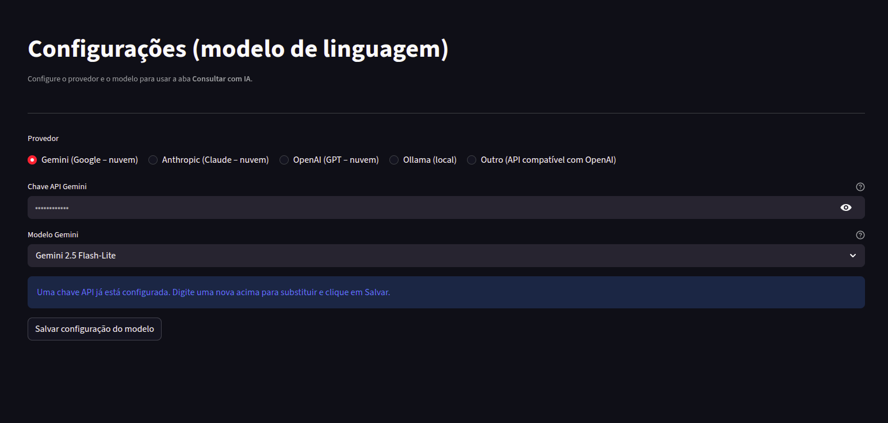

# Configurações

A página de **Configurações** centraliza as preferências do aplicativo.

---

## Provedor de IA

Para usar a aba **Consultar com IA**, configure um provedor de modelo de linguagem:

| Provedor | Requisito |
|----------|-----------|
| **Gemini** (Google) | Chave do [Google AI Studio](https://aistudio.google.com/apikey) |
| **Anthropic** (Claude) | Chave da API Anthropic |
| **OpenAI** (GPT) | Chave da API OpenAI |
| **Ollama** (local) | Apenas o nome do modelo (ex.: `llama3.2`) |
| **Outro** (API compatível) | URL base + nome do modelo |

- Selecione o provedor desejado e cole a chave de API (quando aplicável).
- Escolha o modelo na lista — para o Gemini, a lista é carregada dinamicamente se houver chave válida.
- Após salvar, a chave não é exibida novamente (apenas um indicador de que está configurada).

---

Próximo passo: [Download de Dados](download-dados.md)
