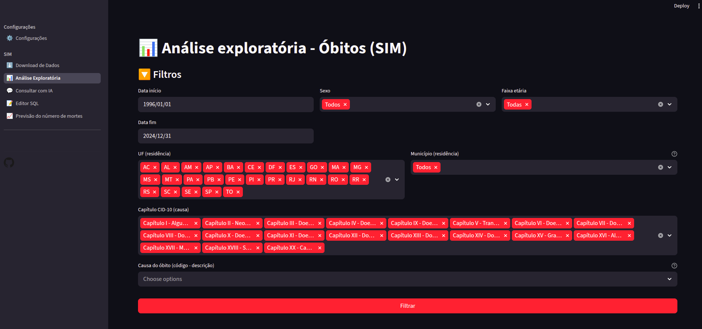
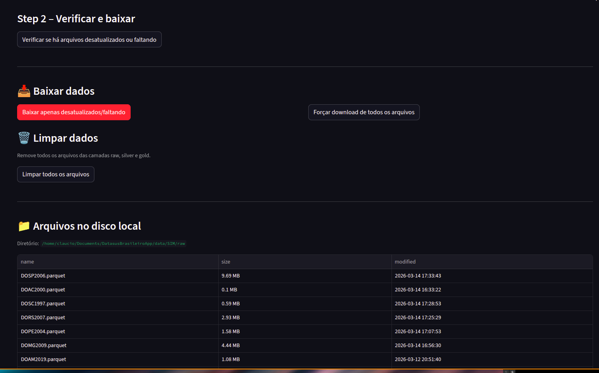

# Download de Dados

A aba **Download de Dados** obtém os arquivos do SIM (Sistema de Informações sobre Mortalidade) do FTP do Datasus e os processa em camadas.

---

## Período e UFs

- Defina o intervalo de **anos** e as **UFs** que deseja baixar, **para um setup inicial escolha um período de anos menor (desde 1996 para todos os estados vai demorar)**.
- Esses valores são usados para buscar os arquivos do FTP.
- As preferências ficam salvas em `data/config.db` (SQLite, criado automaticamente).

---

## Como funciona

O fluxo de dados segue três etapas:

1. **Baixar do FTP** — Arquivos Parquet são baixados por UF e ano para a pasta `data/SIM/raw/`.
2. **Processar silver** — Dados tratados (óbitos, legendas, municípios) são gravados em `data/SIM/silver/`.
3. **Construir gold** — DuckDB é criado com a view analítica `v_obitos_completo` em `data/SIM/gold/`.

---

## Passo a passo

1. Acesse **SIM → Download de Dados** na barra lateral.
2. Verifique se o período e as UFs estão corretos. Ajuste se necessário e clique em **Aplicar período e estados**.
3. Clique em **Baixar** para obter os dados do FTP.
4. Após o download, clique em **Processar silver**.
5. Por fim, clique em **Construir gold**.

> **Importante**: durante o processamento, as outras abas do SIM ficam temporariamente indisponíveis.

---

## Resultado

Após a construção da gold, todas as abas de análise ficam habilitadas:

| Camada | Pasta | Conteúdo |
|--------|-------|----------|
| Raw | `data/SIM/raw/` | Parquets baixados do FTP |
| Silver | `data/SIM/silver/` | Parquets tratados com legendas |
| Gold | `data/SIM/gold/` | DuckDB com `v_obitos_completo` |

---

Próximo passo: [Análise Exploratória](analise-exploratoria.md)
