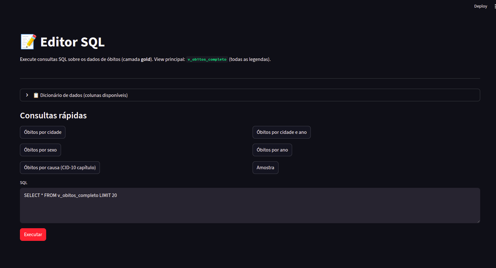

# Editor SQL

A aba **Editor SQL** permite executar consultas SQL diretamente na base DuckDB do projeto.

---

## Como usar

1. Acesse **SIM → Editor SQL**.
2. Escolha uma **consulta pronta** na lista de sugestões, ou escreva a sua no editor de texto.
3. Clique em **Executar** para ver os resultados em tabela.

---

## Consultas prontas

O editor já inclui consultas de exemplo:

- **Óbitos por cidade** — Ranking de municípios por total de óbitos.
- **Óbitos por cidade e ano** — Total por município e ano (a partir de 2020).
- **Óbitos por sexo** — Distribuição por sexo.
- **Óbitos por ano** — Série anual.
- **Óbitos por causa (CID-10 capítulo)** — Top 25 capítulos.
- **Amostra** — 50 registros com colunas principais.

---

## Dicas

- Use `LIMIT` em consultas exploratórias para melhor desempenho.
- Apenas consultas de leitura (`SELECT` / `WITH`) são permitidas — o editor bloqueia operações de escrita.
- A view principal é `v_obitos_completo`; veja o [dicionário de dados completo](../tecnico/editor-sql.md) para todas as colunas disponíveis.

---

## Dicionário de dados (referência rápida)

| Coluna | Descrição |
|--------|-----------|
| `ano` | Ano do óbito |
| `sexo_desc` | Sexo (Masculino / Feminino) |
| `municipio_residencia` | Município de residência |
| `uf_residencia` | UF de residência |
| `causa_basica` | Código CID-10 da causa básica |
| `causa_cid10_capitulo_desc` | Capítulo CID-10 |
| `faixa_etaria` | Faixa etária |

Para o dicionário completo com todas as colunas e tipos, consulte a [documentação técnica do Editor SQL](../tecnico/editor-sql.md).

---

Próximo passo: [Previsão de Óbitos](previsao-obitos.md)
