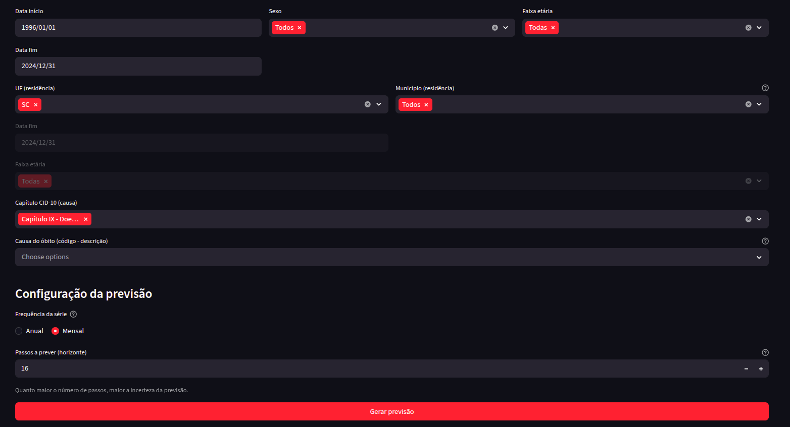
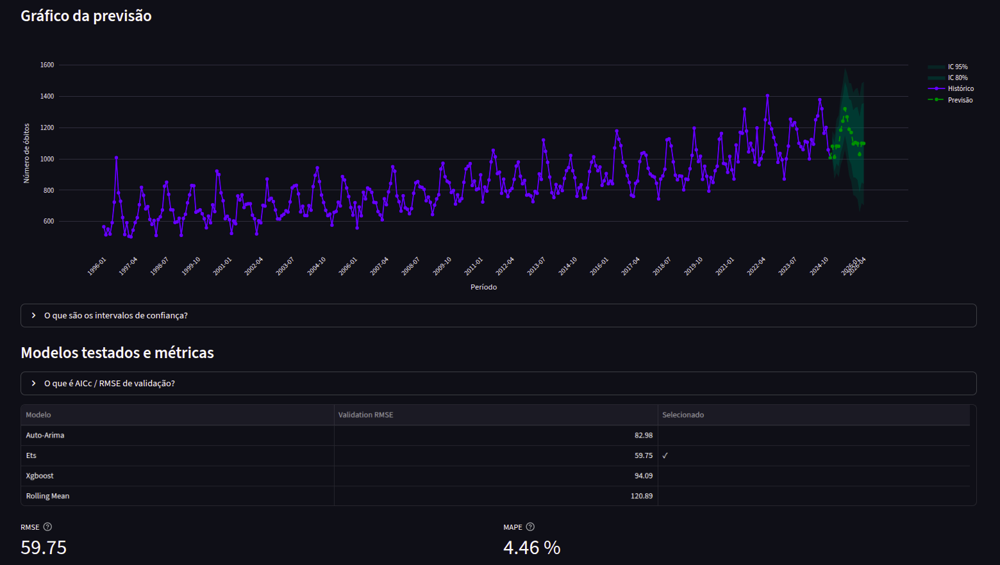

# Previsão de Óbitos

A aba **Previsão de óbitos (forecasting)** projeta o número de mortes para o futuro com base na série histórica, usando um pipeline automático de seleção de modelo.

---

## Requisitos

- Camada **gold** construída (veja [Download de Dados](download-dados.md)).

---

## Como usar

1. Acesse **SIM → Previsão do número de mortes**.
2. **Configure os filtros**: período, sexo, faixa etária, UF, município, capítulo/causa CID-10. Esses filtros definem a série que será usada na previsão.
3. **Escolha a frequência**: Anual (um ponto por ano) ou Mensal (um ponto por mês).
4. **Defina o horizonte**: número de passos a prever (ex.: 2 anos ou 16 meses).
5. Clique em **Executar previsão**.

---

## Interpretando os resultados

O gráfico exibe:

- **Série histórica** — Dados reais de óbitos no período.
- **Previsão** — Projeção pontual do modelo selecionado.
- **Intervalos de confiança** — Faixas de 80% e 95%, indicando a incerteza da projeção.

Abaixo do gráfico, uma seção mostra os **modelos testados e suas métricas**, para que você possa entender qual modelo foi escolhido e por quê.

---

## Como funciona por dentro

O sistema usa o **MortalityForecaster**, um pipeline que testa e seleciona automaticamente o melhor modelo para a série filtrada. Ele passa por 5 fases: validação de entrada, auditoria estrutural, corrida de modelos, auditoria de premissas e seleção final.

Para detalhes técnicos completos, consulte a [documentação técnica do forecasting](../tecnico/forecasting.md).

---

[Voltar ao índice](../README.md)
