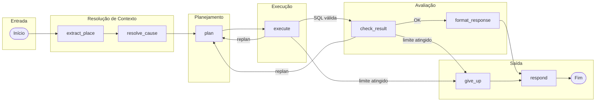

# Agente de IA (Text-to-SQL)

O módulo **Consultar com IA** usa um agente baseado em LangGraph que transforma perguntas em português em consultas SQL sobre a view `v_obitos_completo`, executa e devolve a resposta formatada.

---

## Provedores suportados

| Provedor | Tipo | Detalhes |
|----------|------|----------|
| Gemini (Google) | Nuvem | Chave do Google AI Studio |
| Anthropic (Claude) | Nuvem | Chave da API Anthropic |
| OpenAI (GPT) | Nuvem | Chave da API OpenAI |
| Ollama | Local | Nome do modelo (ex.: llama3.2) |
| Genérico | Nuvem/Local | API compatível com OpenAI |

---

## Grafo do agente

O fluxo segue um grafo com replanejamento automático em caso de falha:

---

## Nós do grafo

| Nó | Módulo | Função |
|----|--------|--------|
| `extract_place` | `municipality.py` | Extrai menção a lugar (cidade/estado/escopo nacional) e resolve para valores canônicos da view |
| `resolve_cause` | `cause_context.py`, `cid10_resolver.py` | Identifica causa/doença e obtém códigos CID-10 ou filtro por capítulo |
| `plan` | `graph.py` | LLM gera uma query SQL (SELECT) usando schema da view e contexto injetado |
| `execute` | `graph.py` | Valida com EXPLAIN e executa na mesma conexão DuckDB |
| `check_result` | `graph.py` | Avaliação determinística do resultado (linhas, coerência) |
| `format_response` | `graph.py` | LLM formata a resposta final em texto |
| `give_up` | `graph.py` | Encerra após limite de tentativas ou erro fatal |
| `respond` | `graph.py` | Retorna resposta final |

---

## Guardrail

Perguntas fora do tema (óbitos, mortalidade, SIM) são rejeitadas **antes** de chamar qualquer LLM. O guardrail (`src/agent/guardrail.py`) verifica a presença de palavras-chave relacionadas ao domínio.

---

## Resolução de contexto

### Lugar
- Heurística sem IA: extrai padrões como "em Curitiba", "no PR", "todos os estados".
- Se encontra um município: resolve para nome canônico via fuzzy match (`rapidfuzz`).
- Se encontra UF: gera filtro por `uf_residencia`.
- Se encontra escopo nacional ("todos os estados", "todo o Brasil"): injeta instrução explícita para **não** filtrar por lugar.

### Causa
- Extrai menção a doença/causa e resolve para códigos CID-10 ou capítulos.
- Exemplo: "dengue" → `causa_basica IN ('A90', 'A91')`.
- Exemplo: "doenças cardiovasculares" → filtro por `causa_cid10_capitulo_desc`.

---

## Schema e cache

- O schema da view, exemplos de valores e lista de municípios são obtidos em um único aquecimento de cache (`src/agent/db_cache.py`), reduzindo consultas repetidas.
- O schema enriquecido (`src/agent/schema_enricher.py`) adiciona valores reais da base para calibrar os filtros do LLM.
