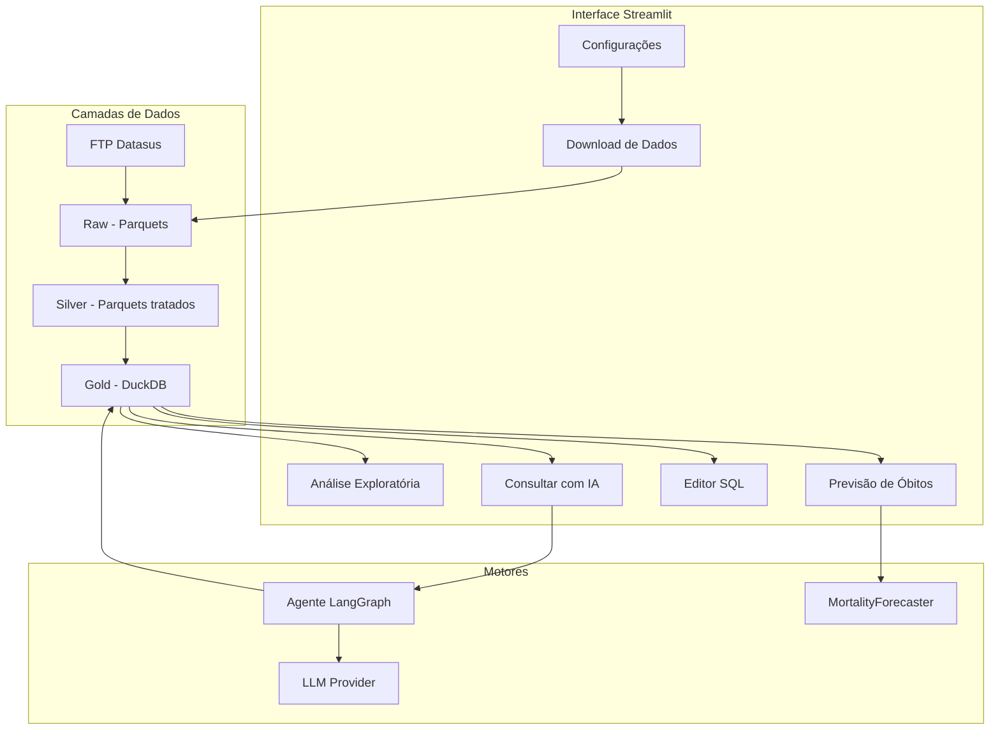

# Arquitetura

Visão geral da arquitetura do **SIM DataSUS**.

---

## Stack tecnológico

| Componente | Tecnologia |
|------------|------------|
| Interface | Streamlit (multipágina) |
| Banco analítico | DuckDB (view `v_obitos_completo`) |
| Configuração | SQLite (`data/config.db`) |
| Agente de IA | LangGraph + LLM (Gemini, Anthropic, OpenAI, Ollama) |
| Forecasting | MortalityForecaster (statsmodels, pmdarima, XGBoost) |
| Gráficos | Plotly |
| Fonte de dados | FTP Datasus (SIM) |

---

## Diagrama geral



---

## Estrutura de pastas

```
DatasusBrasileiroApp/
├── app.py                    # Ponto de entrada Streamlit
├── pages/
│   ├── configuration.py      # Configurações
│   └── SIM/
│       ├── SIM_download.py   # Download e processamento
│       ├── SIM_analise.py    # Análise exploratória
│       ├── SIM_agent.py      # Consultar com IA
│       ├── SIM_sql.py        # Editor SQL
│       ├── SIM_forecast.py   # Previsão de óbitos
│       └── sim_filters.py    # Filtros compartilhados
├── src/
│   ├── agent/                # Agente Text-to-SQL (grafo, guardrail, resolução)
│   ├── config/               # Persistência e segredos
│   ├── data_extraction/      # FTP, processamento e gold catalog
│   └── forecasting/          # MortalityForecaster
├── data/                     # Dados (não versionado)
│   ├── SIM/raw/              # Parquets do FTP
│   ├── SIM/silver/           # Parquets tratados
│   ├── SIM/gold/             # DuckDB
│   └── config.db             # SQLite de configuração
├── docs/                     # Documentação
├── reference/                # Arquivos de referência (municípios, CID-10)
└── tests/                    # Testes
```

---

## Fluxo de navegação

O `app.py` usa `st.navigation` para agrupar as páginas em seções:

- **Configurações** — `configuration.py`
- **SIM** — Download, Análise, Consultar com IA, Editor SQL, Previsão

A documentação completa fica no repositório (pasta `docs/`). Durante operações longas (download/processamento), a navegação restringe as abas do SIM para evitar acessos a dados parciais.
