# Pipeline de Previsão (MortalityForecaster)

O **MortalityForecaster** é um sistema automatizado de previsão de séries temporais de mortalidade. Ele adapta sua lógica à forma, ao tamanho e à estrutura dos dados — alternando entre modos de parcimônia (séries curtas/anuais) e reconhecimento de padrões (séries longas/mensais).

---

## Visão geral do pipeline

O pipeline segue 5 fases sequenciais. Cada fase impõe restrições que a fase seguinte herda — não é uma caixa-preta.

---

## Fase 1 — Portão de Entrada (Frequência e Volume)

O sistema examina a "forma" dos dados para definir as regras do jogo.

**Caminho anual**: se os dados são anuais, o sistema assume amostra pequena (n) e ativa o **modo de parcimônia**, penalizando fortemente a complexidade para evitar sobreajuste em registros históricos escassos.

**Caminho mensal**: se os dados são mensais, o sistema ativa a **detecção de sazonalidade** e permite modelos capazes de capturar padrões cíclicos.

**Regra do n mínimo**: se n < 5, o sistema ignora toda a modelagem e retorna uma média simples ou o último valor registrado — uma estimativa segura e transparente.

**Limiar de volume mensal**: para dados mensais, o sistema verifica se n >= 60 (5 anos) antes de permitir validação hold-out. Abaixo desse limiar, recorre ao AICc como métrica de seleção — porque com poucas observações, reservar uma janela de validação produz estimativas ruidosas demais.

---

## Fase 2 — Auditoria Estrutural (Testes Estatísticos)

Antes de qualquer modelo rodar, os dados são interrogados para determinar que estrutura podem realisticamente suportar.

### Etapa A — Teste de tendência

O sistema executa os testes **Mann-Kendall** e **Cox-Stuart** em conjunto. Mann-Kendall é o decisor primário (lida melhor com não-normalidade e amostras pequenas). Cox-Stuart serve como verificação corroborativa. Uma tendência só é confirmada se ambos os testes concordarem. Sem tendência detectada, os modelos são travados em versões estacionárias — impedindo a projeção de uma "tendência fantasma".

### Etapa B — Teste de sazonalidade (apenas mensal)

Para dados mensais, o sistema testa a existência de um padrão repetitivo de 12 meses (teste F). Se ausente, os componentes sazonais em ARIMA e ETS são desabilitados, preservando graus de liberdade.

### Etapa C — Teste de estacionariedade (ADF)

Determina se média e variância são estáveis ao longo do tempo. Define quantas vezes os dados precisam ser diferenciados antes da modelagem ARIMA.

Após os testes, as restrições ficam travadas: tendência, sazonalidade e número de diferenças.

### Detecção de outliers

Observações que desviam fortemente do envelope histórico são detectadas por triagem de resíduos (±3 desvios-padrão) e verificação IQR. Outliers confirmados recebem uma **variável dummy de intervenção**, impedindo que distorçam os parâmetros centrais do modelo. O objetivo é proteger a previsão de ser ancorada a um passado anômalo.

---

## Fase 3 — Corrida de Modelos

Candidatos são ajustados com as restrições herdadas da Fase 2.

| Candidato | Descrição | Condição |
|-----------|-----------|----------|
| **Auto-ARIMA** | Busca estrutura de autocorrelação; ordem de diferenciação definida pela Fase 2; termos sazonais só se a Etapa B confirmou sazonalidade | Sempre |
| **ETS / Holt** | Foco em nível, tendência e sazonalidade; para dados anuais, tendência amortecida por padrão (realidade demográfica: crescimento se estabiliza) | Sempre |
| **XGBoost** | Série dessazonalizada; features de lag selecionadas por importância com validação cruzada | Apenas mensal, n >= 60 |
| **Média móvel** | Média móvel de 3 anos ou 12 meses; serve como **benchmark** — qualquer modelo complexo que não supere significativamente este é considerado uma falha | Sempre |

---

## Fase 4 — Auditoria de Premissas (Rodada de Desqualificação)

Um score de erro baixo não garante sobrevivência. Modelos são desqualificados por falhas estruturais.

**Verificação de resíduos (Ljung-Box)**: o sistema inspeciona os resíduos do modelo em busca de padrões remanescentes. Padrão nos resíduos significa que o modelo deixou escapar algo sistemático — o modelo é rejeitado.

**Verificação de coeficientes**: cada parâmetro é testado para significância estatística (p-value). Modelos que dependem de termos com p-value alto (ex.: um lag complexo sem contribuição real) são rejeitados como sobreajustados.

Modelos desqualificados são descartados e o pipeline continua com os sobreviventes.

---

## Fase 5 — Seleção Final

Os modelos sobreviventes são ranqueados e a seleção final é feita.

**Métrica de seleção**:
- Para amostras pequenas ou anuais (ou mensais com n < 60): ranqueamento por **AICc**, que penaliza complexidade severamente em relação ao tamanho da amostra.
- Para séries mensais maiores (n >= 60): ranqueamento por **RMSE de validação** em janela hold-out.

**Regra de parcimônia**: se a vantagem do melhor modelo sobre a média móvel estiver dentro de uma margem definida, o sistema seleciona a média móvel por sua robustez e interpretabilidade.

**Intervalos de previsão**: o modelo selecionado produz não apenas uma previsão pontual, mas **limites de incerteza calibrados** (intervalos de 80% e 95%). Para aplicações de mortalidade, uma projeção sem intervalos de confiança é incompleta — tomadores de decisão precisam ver a faixa de resultados plausíveis.

---

## Tabela-resumo

| Tarefa | Lógica Anual | Lógica Mensal |
|--------|-------------|---------------|
| Detecção de tendência | Mann-Kendall (primário) + Cox-Stuart (corroboração) | Idem, mais diferenciação ou remoção de tendência |
| Sazonalidade | Ignorada — dados insuficientes | Teste obrigatório de 12 meses |
| ML (XGBoost) | Proibido — risco alto para n pequeno | Permitido com n >= 60, seleção de lags por validação cruzada |
| Métrica de seleção | AICc | AICc se n < 60; RMSE de validação se n >= 60 |
| Verificação de integridade | Penalidade pesada para parâmetros extras | Foco em captura sazonal e brancura dos resíduos |
| Tratamento de outliers | Dummy de intervenção para proteger parâmetros | Idem |
| Saída | Previsão pontual + intervalos de previsão | Previsão pontual + intervalos de previsão |

---

## Referência

Código-fonte: `src/forecasting/MortalityForecaster.py`
