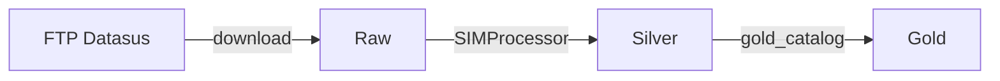

# Pipeline de Dados

O pipeline transforma dados brutos do FTP do Datasus em uma view analítica otimizada para consultas.

---

## Camadas

### Raw (`data/SIM/raw/`)

- Parquets baixados diretamente do FTP, organizados por UF e ano (ex.: `DOPR2023.parquet`).
- Nenhum tratamento aplicado.
- Fonte: `src/data_extraction/FTPGeneral.py` + `pysus`.

### Silver (`data/SIM/silver/`)

- Parquets tratados pelo `SIMProcessor`:
  - `obitos.parquet` — Declarações de óbito com colunas normalizadas e datas convertidas.
  - `municipios.parquet` — Tabela de municípios (código IBGE, nome, UF).
  - Legendas: `legenda_sexo.parquet`, `legenda_racacor.parquet`, `legenda_cid10_capitulo.parquet`, `legenda_cid10_causa.parquet`, `legenda_circunstancia.parquet`, `legenda_tipo_obito.parquet`, `legenda_local_ocorrencia.parquet`, `legenda_estado_civil.parquet`.
- Fonte: `src/data_extraction/SIMProcessor.py`.

### Gold (`data/SIM/gold/`)

- DuckDB (`obitos.duckdb`) com a view `v_obitos_completo`.
- A view faz JOIN de óbitos com todas as legendas e municípios, adicionando colunas derivadas:
  - `idade_anos`, `faixa_etaria` — Calculadas a partir do código de idade do SIM.
  - `ano`, `dt_obito_mes` — Extraídos da data de óbito.
  - `causa_cid10_desc`, `causa_cid10_capitulo_desc` — Descrições da CID-10.
- Fonte: `src/data_extraction/gold_catalog.py`.

---

## View `v_obitos_completo`

Principais colunas (resumo):

| Coluna | Tipo | Descrição |
|--------|------|-----------|
| `ano` | INTEGER | Ano do óbito |
| `dt_obito` | DATE | Data do óbito |
| `dt_obito_mes` | DATE | Primeiro dia do mês do óbito |
| `sexo_desc` | VARCHAR | Descrição do sexo |
| `idade_anos` | INTEGER | Idade em anos |
| `faixa_etaria` | VARCHAR | Faixa etária (ex.: "60-69") |
| `municipio_residencia` | VARCHAR | Município de residência |
| `uf_residencia` | VARCHAR | UF de residência (sigla) |
| `causa_basica` | VARCHAR | Código CID-10 da causa básica |
| `causa_cid10_capitulo_desc` | VARCHAR | Capítulo CID-10 |
| `circunstancia_desc` | VARCHAR | Circunstância do óbito |

Para o dicionário completo, veja [Editor SQL (técnico)](editor-sql.md).

---

## Dependências entre camadas

- **Análise Exploratória**, **Consultar com IA**, **Editor SQL** e **Previsão** requerem a camada gold.
- Se a gold não existir, essas abas exibem aviso orientando a construção.
